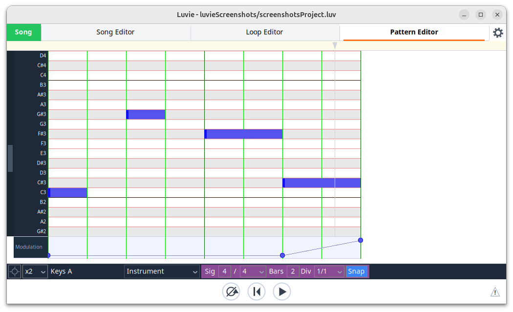
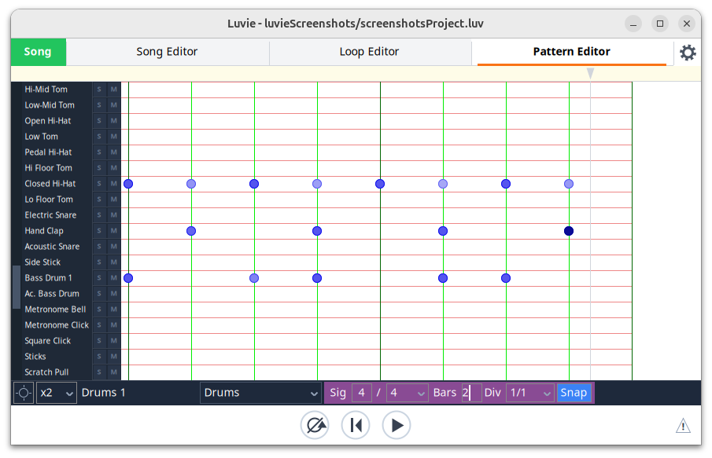
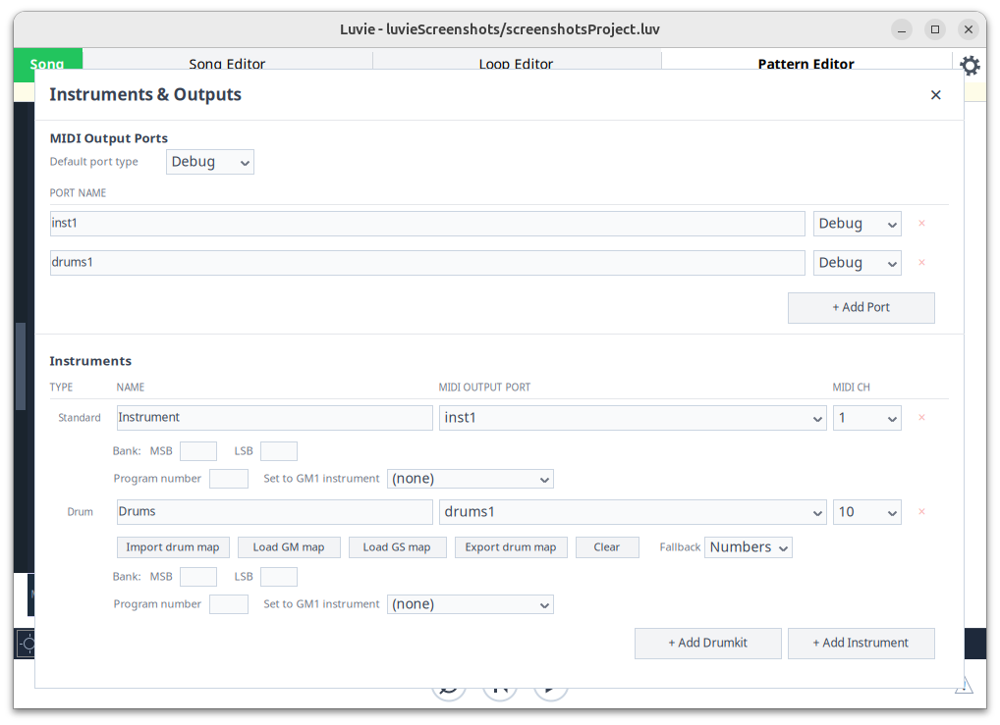

# Description
A free music sequencer for Linux, Mac and Windows. (On Mac and Windows the window cannot yet
be moved or resized — the custom window decorations are still to be ported.)

# The Story
The main things that make this sequencer special in the world of Linux audio are:
1. It combines harmony-based patterns (defined using chords and scales) with a song editor - basically making it a mash-up of HarmonySeq and Seq24.
1. It has the option to run as an LV2 plugin as well as standalone, simplifying session management. 
1. It has decent support for driving drumkits.
1. It has been redesigned and rebuild ground-up, so hopefully it is a bit easier to understand and use than some earlier efforts.

# Screenshots

### Song Editor
Arrange pattern instances across tracks, with tempo and time signature markers on the rulers,
and automation lanes for continuous controllers.

### Pattern Editor — harmony
Notes are placed against a chord and scale (here D maj7), so the pattern transposes with the
harmony rather than being locked to fixed pitches.

### Pattern Editor — piano roll
An alternative pattern editor that uses absolute pitches. Also shown is a modulation lane underneath.

### Pattern Editor — drums
A drum editor. It supports creating and saving your own drum maps.

### Loop Editor
Launch and stop patterns live without touching the song arrangement.

### Instruments &amp; Outputs
Define MIDI output ports and map instruments and drumkits onto them.

# Manual
For details please consult the [Luvie manual](docs/manual/README.md) 

# Dependencies
JACK is optional, but desirable.

# Distribution

Download from the [latest release](https://github.com/benbriedis/luvie/releases/latest). 
