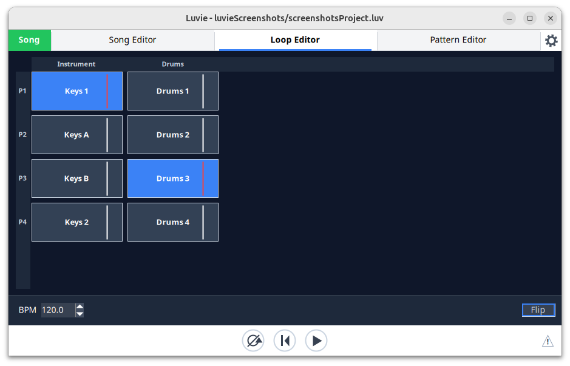

# Loops

[← The song editor](04-song-editor.md) · [Contents](README.md) · [The pattern editors →](06-pattern-editors.md)

Luvie comes with a Loop Editor as well as a Song Editor. The Loop Editor show what is playing when Luvie is in 'Loop Mode' and provides a more live experience that 'Song Mode' - see Basics (TODO add link to Basics). When in Loop Mode it is easy to experiment with combining patterns in different ways. It may in time be suitable for live performance, but early days.

[TODO update the screenshot]

In the screenshot above each column contains the patterns that currently exist for an instrument. Press the 'Flip' button to swap the columns and rows.

The patterns that are currently playing are hightlighted.

## The loop editor

Left click on a pattern to start or stop playing it. Patterns will continue to play in loops until disabled.

Right click on a pattern block to open a pattern in the corresponding Pattern Editor, or to add, remove, or copy a pattern.

It is possible to rename an instrument in the editor by double clicking on the instrument name.

## Switching between modes

It is possible to switch between Song Mode and Loop Mode while music is playing.
Switching modes is designed to minimize glitches in the music during the transition.
In both directions the current bar is played out and the new mode takes over on the next barline,
in the same way as switching between scenes. While the switch is pending the mode button is shown
in yellow and still carries the label of the mode that is playing.

When switching from Song Mode to Loop Mode the song plays to the end of its current bar. At the barline
the loops take over and the playhead in the Song Editor is frozen and greyed out on that barline.
The patterns that were playing continue to be played and looped, and they can be viewed and controlled from the Loop Editor.

When switching from Loop Mode to Song Mode the loops play out the rest of their bar. The playhead in the
Song Editor is immediately unfrozen (still greyed out) and moves up to the bar it was frozen on, arriving
there as the next barline is reached. At that point control over the output of notes passes back to the Song Editor.

If the transport is stopped the switch happens immediately. Clicking the mode button again while it is
yellow cancels the switch.
