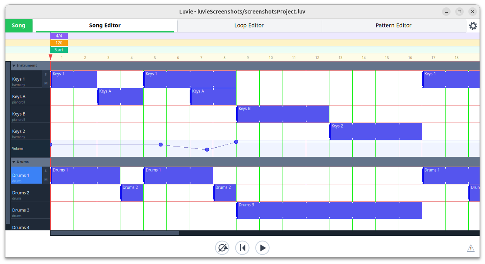
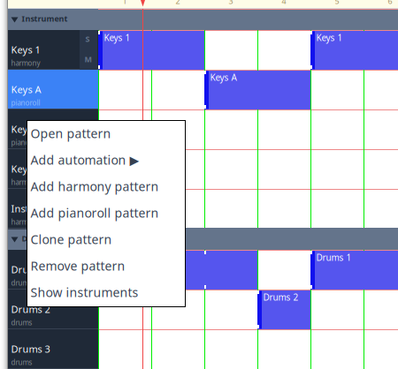
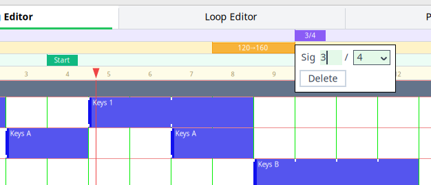

# The song editor

[← A simple walk through](04-walkthrough.md) · [Contents](README.md) · [Loops →](06-loop-editor.md)

## Tracks

The user can create many patterns for a given instrument and these can be enabled
at various times thoughout the song. The song editor organises these patterns using "tracks", 
with each track containing the entire arrangement of patterns for a given instrument.  
A track in turn is divided into multiple "lanes" with each lane controlling 
a single pattern.

Tracks can be muted or soloed using the S and M buttons that sit in the first lane of each track.

## Placing pattern blocks

You indicate a pattern is to play by using what I'm going to call "pattern blocks".
To add a pattern block simply click somewhere in the grid.
Having added a pattern block you can move it by clicking and dragging,
and resize it by clicking and dragging the left or right edge.

One feature of the Luvie song editor is that it's possible to start patterns part way
through one of the song editor's patterns or even bars. Ticks have been added to pattern blocks 
to indicate where patterns start. One reason including this feature is that 
patterns can have different time signatures that don't necessarily match
the current time signature of the song.

To delete a pattern block either hover the mouse over the block and press Delete or 
right-click the block and select Delete from the context menu.

## Pattern operations

Right-clicking the column on the left hand side pops up this context menu:

This menu allows you to add and remove patterns and automation.

## Automation 

"Automation" describes modifying things like pitch, modulation, panning, expression and 
volume using MIDI parameters.  You can add an automation lane via the context menu
descibed above. 

Automation lanes use rubberbands.
New change points can be added to a rubberband by single-clicking. 
To delete a change point right-click a dot and select Delete from the popup menu.

## Rulers and markers

At the top of the song editor there are a number or "rulers". These are
the time signature ruler, the tempo ruler, the loop ruler, and the transport ruler.

To add, remove or modify markers in the rulers right-click a ruler. 
Most markers can are movable using click-and-drag.

