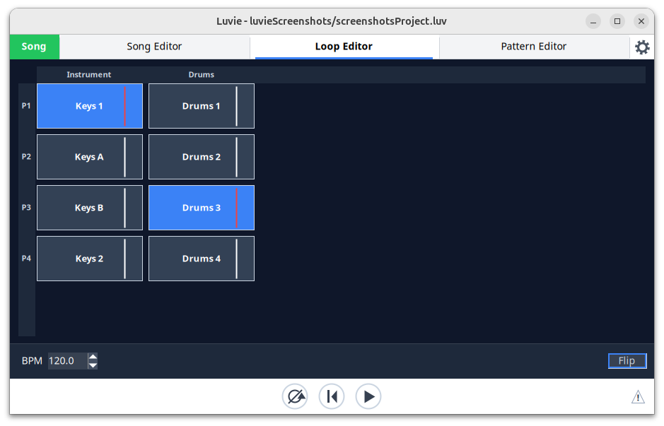

# Loops

[← Tempo, beats and bars](07-tempo-and-beats.md) · [Contents](README.md) · [Harmony patterns →](09-harmony-editor.md)

Each column is an instrument and each row is a loop slot; the highlighted cells
are the patterns currently playing.

TODO: what a loop is, and how it differs from a pattern instance in the song.

## Song mode and loop mode

TODO: what each mode plays, and how to switch.

TODO: switching modes is designed not to interrupt anything — loops keep playing
across the switch, the song playhead freezes (and greys) while in loop mode, and
returning to song mode seeks back to a bar boundary. Worth documenting because
the button changes colour to signal the pending seek.

## The loop editor

TODO: creating, naming and deleting loops; the loop ruler; the context menu.

TODO: the loop panel is BPM-only — it has no time signature of its own, because
each pattern brings its own. Cross-reference
[Tempo, beats and bars](07-tempo-and-beats.md).
