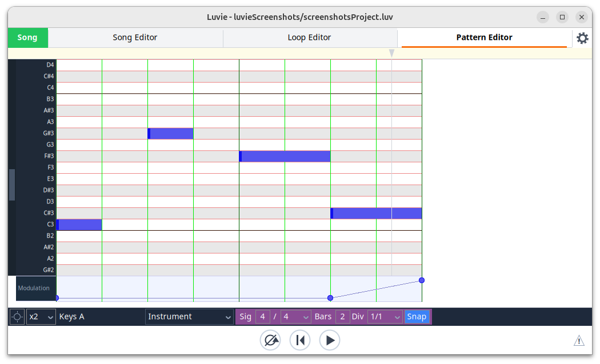
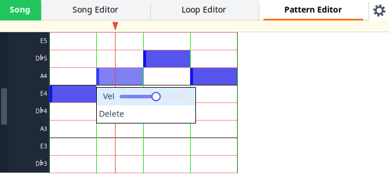
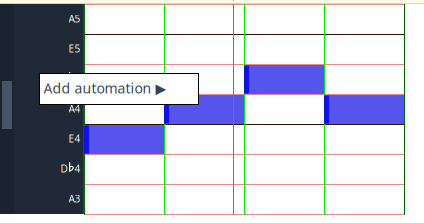

# The pattern editors + focus on the pianoroll editor

[← Loops](05-loop-editor.md) · [Contents](README.md) · [Harmony patterns →](07-harmony-editor.md)

A pattern is a short piece of music that the song editor places on a timeline.
Luvie has three different types of pattern: pianoroll, harmony, and drum.

The pianoroll editor is a fairly conventional editor - similar to those used in many
other MIDI sequencers. Being the simplest of the pattern editors we'll also use it 
to describe the features common to all of the pattern editors. 
Most of the basic controls and operations are shared with the other two pattern editors.

## The pianoroll editor

Each row represents one semitone, labelled with its note name. A parameter lane (Modulation, above) can be shown
beneath the grid.

## Adding and removing notes

To add a note simply click somewhere on the grid. To remove it you can hover over the
note and press delete or right click on it and choose delete from the menu.

You can change the length of a note by clicking the left or right hand side of it and
dragging.

Let's say you want your notes to be longer or shorter... change the 'Div' setting in the
timing panel, or click on 'Snap' to disable it. The same two settings quantise notes
played in from a MIDI keyboard — see
[Recording from a MIDI keyboard](#recording-from-a-midi-keyboard) below.

## Velocity

The 'velocity' of a note is how loud the note is in MIDI-speak. 
It's obscure terminology but don't blame me, I just work here.

To change it right click on a note and adjust using the slider.

## Automation

MIDI parameters such as pitch bend, modulation, etc can be automated using rubberbands in dedicated automation lanes. 
See the screenshot above for an example. Note that this automation applies at a pattern level, but the song editor has its own automation lanes

To create a lane right-click on the track in the left hand column and choose 'Add automation'.

You can add dots on the rubberbands by clicking on it. You can click and drag them around, and you can delete them
either by hovering over them and pressing delete or by right-clicking on them and using the menu option.

### Parameters

Each automation lane controls a *parameter*. The 'Add automation' menu lists the standard MIDI ones
under 'Standard' (Pitch, Modulation, Volume, Pan and Expression) and the rest of the General MIDI
controllers (Sustain, Cutoff, Resonance, Reverb, Channel pressure, ...) under 'Other standard'. The
instrument's own parameters (see below) are under 'Custom'.

Synths have many more controls than these, and they don't agree on which CC does what, so each
instrument can also have parameters of its own. To add one, choose 'New parameter...' from the
'Add automation' menu, give it a name and say what it sends (see below). Its lane is added and you can
draw its values with the mouse, as with any other lane. No MIDI controller is needed. A parameter of
the instrument's own lasts as long as it has lanes: deleting its last lane, in the Song Editor or in any
pattern, deletes the parameter too.

If you do have a controller, 'New (MIDI learn)' is quicker: choose it and move the control on your
controller. Luvie makes a parameter that sends
whatever that control sends, adds its lane, and binds the control to it. If the control sends a standard
CC the parameter gets the standard name (CC74 becomes 'Cutoff'). Otherwise it is named after the CC, e.g.
'CC21'. The control's movements go straight through to the synth, so if your synth has its own MIDI learn
you can use it at the same time.

To rename a parameter or change what it sends, right-click its lane and choose 'Edit parameter'. You can set:

- **Name**: renames the parameter's lanes on this instrument too.
- **Receives**: the control on your controller that drives it: a CC (with its number), pitch bend,
  channel pressure, or nothing. This is the same as MIDI-learning it, set by hand.
- **Sends**: a CC (with its number), pitch bend or channel pressure.
- **Min** and **Max**: the part of the output's range the lane covers, 0 to 127 by default (0 to
  16383 for pitch bend). The lane still runs from bottom to top, but what is sent is scaled into
  this range, so a lane can focus on the useful part of a synth control, e.g. a cutoff sweep
  between 40 and 90. This applies to playback and to a controller played through live. Setting Min
  above Max turns the control upside down.
- **Rests**: Min, Centre or Max. A new lane starts at this value. Centre also draws a dotted line
  through the middle of the lane, as for Pitch and Pan.

The popup also shows the parameter's current **Value**: the last value its control sent, as shown
in its lane's label. It updates as you move the control. When Min and Max narrow the range, it
also shows what that value sends, e.g. "64, sends 50".

The standard parameters can be edited the same way, e.g. pointing Volume at a different CC for a synth
that doesn't follow the standard. The change only affects that instrument, and lasts as long as the
parameter has lanes there: deleting its last lane puts it back to the standard.

A standard parameter added to the project starts out receiving its standard control, so a controller
sending CC74 drives Cutoff without being learned. If that control already drives another parameter it
stays with that one, and the new parameter starts unbound. Deleting the last lane of a parameter
anywhere in the project forgets its control, so adding it again starts afresh. Pitch and Modulation
keep the pitch wheel and mod wheel throughout.

What a parameter *sends* is separate from which control *drives* it ('MIDI learn' on the lane). That
means the pitch wheel can drive a Cutoff lane. The wheel springs back when you let go, and that is
recorded like any other movement. MIDI learn is optional. Where nothing is being recorded, as in the Song Editor
and the Harmony Editor, a bound control still lets you play the parameter live while you audition.

## Time slices

Sometimes you want to move or copy a whole stretch of a pattern - the notes and the automation
together. Hold Alt and drag across the grid (or the automation lanes) to select a time slice. It runs
from the top of the grid to the bottom of the automation lanes.

- Drag inside the slice to move it left or right.
- Ctrl-C, Ctrl-X and Delete copy, cut and clear it. Right-clicking inside the slice gives the same menu.
- Ctrl-V (or right-click → 'Paste selection') pastes the slice with its start at the cursor. It replaces whatever was there.

As with the Shift-drag selection, a note that overlaps the edge of the slice is taken whole.

A slice can also be pasted into another pattern of the same type. Pick the other pattern and paste as usual.
Automation lanes the other pattern doesn't have yet are added. Harmony slices keep their chord degrees,
so they can go into a pattern with a different chord. Degrees that chord doesn't have become bonus notes.

A slice takes the automation dots inside it and nothing more, and no dots are added at its edges. If a
pasted or moved slice starts or ends at a different value to its surroundings, the automation ramps
between them. To make it jump instead, add dots at the edges yourself. Cutting a slice leaves a straight
ramp across the gap.

Note that some Linux window managers use Alt-drag to move windows. If Alt-drag moves the Luvie window,
change the window manager's modifier key (often Super is an option).

## Control row

The main controls of the pattern editors are found at the bottom of the UI.

The first control scrolls the grid to show the notes, and the second zooms the grid out horizontally.

Next comes the pattern name. Double click to edit.

The next control is a dropdown containing the instrument name. This maps to the MIDI output and MIDI channel used.
You can add or modify instruments by clicking the gear icon at the top right of the screen.

## Timing controls 

To the right of the main controls, with a dark pink background, are the timing controls.

The first two controls define the time signature.

Patterns have their own time signatures, and these are independent of those shown in the Song Editor. 
As a result it is possible to play patterns with different time signatures against one another, 
both in song mode and edit mode. In the Song Editor the beginning of patterns are marked with ticks in 
the pattern blocks.

The time signature denominator has three different '8' options, same as the Song Editor. 
These different versions determine how the beat is defined. See [BPM and time signatures](09-beats-and-times.md) for details.

The next control determines the number of bars in the pattern.

The next control declares how many parts to divide each beat into. This determines the granularity to to use when 
adding and resizing notes. It is possible to go free-form by deselecting the 'Snap' control.
  

## Recording from a MIDI keyboard

The **Record** toggle at the right-hand end of the control row arms recording. It
appears for the pianoroll and drum editors; the harmony editor has no Record
toggle, because its rows are chord degrees rather than pitches and there is no
reliable way to turn a played note back into one.

Set the MIDI input up first — see
[MIDI input, output and instruments](03-outputs.md). Once a keyboard is
connected, playing it sounds each instrument that has **Pass through** on,
whether or not you are recording, so you can try things out before committing to
them.

Only MIDI from the input and channel the pattern's instrument is played from is
heard and recorded; see
[Playing an instrument from a MIDI input](03-outputs.md#playing-an-instrument-from-a-midi-input).

Notes are written only when **Record is armed *and* the transport is running**.
Nothing is recorded while playback is stopped, so you can arm the toggle, find
your place, and start when you are ready.

That is the whole requirement. It does not matter whether the pattern is switched
on in the Loop Editor, or whether the song playhead happens to be inside one of
its blocks, or even whether the pattern is still on screen: an armed pattern is
recorded into, in Song Mode and Loop Mode alike. When nothing is playing the pattern it simply runs alongside the song
from bar 1, and the playhead in the editor is drawn greyed to show that you are
recording into it without hearing it. Switch it on in the Loop Editor if you want
to hear it as well.

### Recording several patterns at once

**Record** belongs to the pattern, not to the editor. Arm it, then select another
pattern: the first stays armed, and the toggle now shows the state of the pattern
you are looking at. Arm that one too and both record. You can go on to the Song
or Loop tab and they keep recording there.

Every armed pattern listens to its own instrument's MIDI input, channel and side
of the keyboard split — so with two keyboards, two channels or a split
keyboard, each hand or player can be recorded into a different pattern in the
same pass. Armed patterns whose instruments share
an input all hear it.

## Recording into the song

A take in Song Mode is something you want to hear back in its place, so the first
note of one puts the pattern there: a block appears on the pattern's own track.
It starts at the bar you started the transport from — nothing is cut off before
your first note — and repeats the pattern up to the end of the pass you are
playing in. With **Grow** armed, the pattern itself starts there instead, and the
bars before your first note become part of it. Swap to the Song Editor afterwards
and it is waiting for you, and from that moment you hear the pattern as you
overdub further passes. Undoing the take takes the block with it.

When several patterns are recording, each gets its own block on its own track.

Nothing is placed if there is already a block under the playhead — you are
recording into that one — and nothing is placed in Loop Mode, or when the pattern
is switched on in the Loop Editor, because then you are working on the pattern
rather than on the song. If the pattern is already playing from a block elsewhere
in the song, the new block keeps that timing and starts at the pass you are in.

The Song Editor does not allow blocks on a track to overlap, so a neighbouring
block shortens the new one: it starts after a block that ends before the
playhead, and stops at one that starts after it. If there is no room at all
around the playhead, no block appears; the take still records, and you can make
room and place the pattern yourself.
Run Luvie with `LUVIE_DEBUG=1` and it will say when this happens.

What gets recorded:

- **Snap quantises what you play.** With **Snap** on, the start and end of each
  note are rounded to the nearest division — the same **Div** setting that
  positions notes you add with the mouse. A note too short to survive the
  rounding is given one division rather than disappearing. Turn Snap off and
  notes are written exactly where you played them, for as long as you held the
  key. In the drum editor only the start is quantised, because drum notes have
  no length.
- **Notes stop at the end of the pattern.** Hold a key past the last beat — over
  a loop's turnaround, say — and the note ends there rather than running past it
  or reappearing at the start. Let go and press again on the next pass to record
  the note a second time.
- **Recording adds, never replaces.** Playing over a part that already has notes
  leaves them alone, so you can build a part up in several passes.
- **A whole pass is one undo.** However many notes a take contains, one Ctrl+Z
  removes all of them. A take ends when you disarm the toggle or stop the
  transport — the next one is its own undo entry. Patterns recorded in the same
  pass are undone together.

Stopping or pausing the transport disarms **Record** on every pattern, so the next
take is always one you have just asked for. A key still held down when that
happens is written with the length it reached rather than being lost. Arms are
not saved with the project.

## Flexible bars

Ordinarily you have to decide how many bars the pattern is before you play it.
The **Grow** toggle, immediately left of **Record**, lets you decide afterwards.
Like **Record** it belongs to the pattern and stays set while you look at other
patterns, but it is not disarmed when the transport stops.

Arm **Record** and **Grow**, and start the transport. Nothing changes at first:
the pattern loops the way it always does, so you can wait for your entry. The
moment you play your first note the pattern stops looping, and from then on it
gains a bar each time the playhead approaches the end. Keep playing for as long
as the part lasts.

When the take ends — you stop the transport, or disarm **Record** or **Grow** —
the bars you did not play into are taken off again. The
pattern never ends up shorter than it was before the take, and never shorter
than one bar. As always, the whole take is one Ctrl+Z, and that includes the
bars it added.

In Song Mode the block grows with the pattern — the one placed for the take, or
the one you were already recording into — so what you played is what the song
plays back. Two things stop the growth, and in both cases recording simply
carries on as it would with **Grow** off:

- the next block on the same track, which the growing block will not overlap;
- 64 bars, the longest the **Bars** control can describe.

A couple of things worth knowing:

- **Starting inside a block means starting at its beginning.** A block can be
  several repeats of its pattern long. If you come in during the second repeat
  there is no way to extend the one you are in without moving what is already
  playing, so the take records normally instead. Run Luvie with `LUVIE_DEBUG=1`
  and it will say so on the terminal. A block placed for the take is always one
  repeat long, so this only comes up on blocks you stretched yourself.
- **A pattern is shared.** Placing the same pattern in several parts of the song
  and then growing it makes all of them longer, because they are all the same
  pattern. Copy it first if you only want one of them to change.
