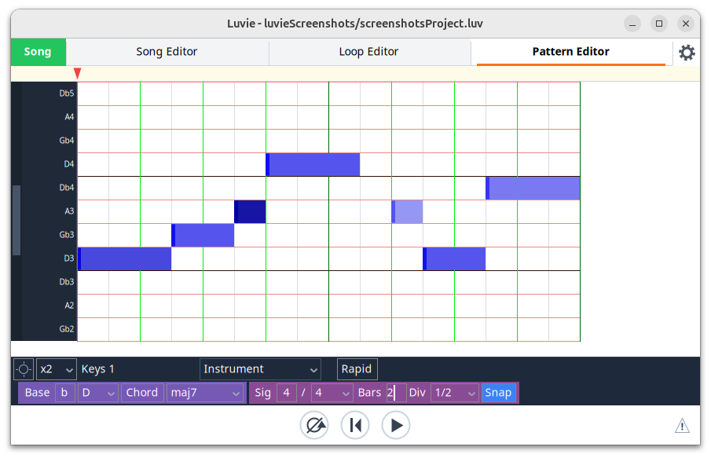

# The harmony pattern editor

[← The pattern editors](06-pattern-editors.md) · [Contents](README.md) · [The drum pattern editor →](08-drum-pattern-editor.md)

This editor is arguably the meat and potatoes of this sequencer.

A harmony pattern does not store fixed pitches. 
Instead it stores the positions within an initial chord or scale (ie 1, 2, 3, ...), and calculates the pitches 
to output by looking up these positions within the currently selected chord or scale, set relative to the currently 
selected base/root note. The user can quickly change the currently selected chord or scale or base note.
This makes it easy for the user to create repeating patterns that move through shifting harmonic landscapes. 

## The pitch control panel

The purple pitch control panel determines which chord or scale to play and what its
base note is. Changing these settings does not modify the pattern — 
it changes the pitches that are output.

From left to right the pitch control panel contains:
- A sharp/flat toggle that determines whether flats or sharps are to be used in the scales or chords.
- The base (ie root) note to use for the current chord or scale.
- A chord/scale toggle button. This will change what is shown in the next dropdown.
- A chord or scale dropdown that lists a large number of available chords or
  scales. These are divided into categories.
  Currently only scales and chords belonging to the 12-tone well-tempered scale
  are included. 
  I would like to extend to microtonal scales soon (NB this requires good MIDI 2.0 support).

In addition it should be noted that the user is free to shift pitches manually
by selecting multiple notes, clicking and dragging.

## The mapping algorithm

So when we swap between different types of scales and chords how do we map the notes?
Different approaches could be taken, but we use a fairly simple one...
- The first note of the old scale or chord becomes the first note of the new scale or chord
- The second note of the old scale or chord becomes the second note of the new scale or chord
- The third note of the old scale or chord becomes the third note of the new scale or chord
  
and so on.

Now most chords have a 1st, a 3rd (or a 3rd substitute), a 5th, then a 7th or 6th if it extends that far, and then some extra notes if it continues further.
So for the most part this simple approach yields decent results moving between different chord types,
with 1 staying as 1, a 3rd becoming a 3rd, a 5th becoming a 5th, a 7th becoming a 7th.

One nice property of this approach is that its possible to change the chord or scale, and then on
coming back to the original chord or scale the original notes are reinstated.

Moving between different scales mostly works pretty well too as most scales have
a 1st, 2nd, 3rd, etc and notes are mapped like-for-like. Changes are likely to be less 
dramatic when changing between scales (or chords) containing the same number 
of notes as one another.

Now some chords and scales extend over more than one octave. To help describe how we deal with this let's 
define the term *pitch group*. A pitch group is a set of rows covering one chord or scale and can be larger
than one octave. The harmony editor splits the grid vertically into multiple pitch groups, separated by 
dark lines.

The root note of one pitch group always sits one octave above and one octave below the root notes
of its neighbouring pitch groups. In cases where a pitch group extends beyond one octave
pitches will *not* strictly ascend as you go up the rows. Instead the pitch will drop down a bit
as you cross over from one pitch group to the next.

What happens when you change the type of chord or scale and the number of notes in 
the pitch group decreases? Ie, what happens to the extra notes at the top of the old
pitch group? Well these are kept and converted into "bonus notes". The rows these notes sit in are 
coloured grey, and are mapped on to notes in the pitch group above.  
If the user removes all the bonus notes in a row then the grey row disappears.
